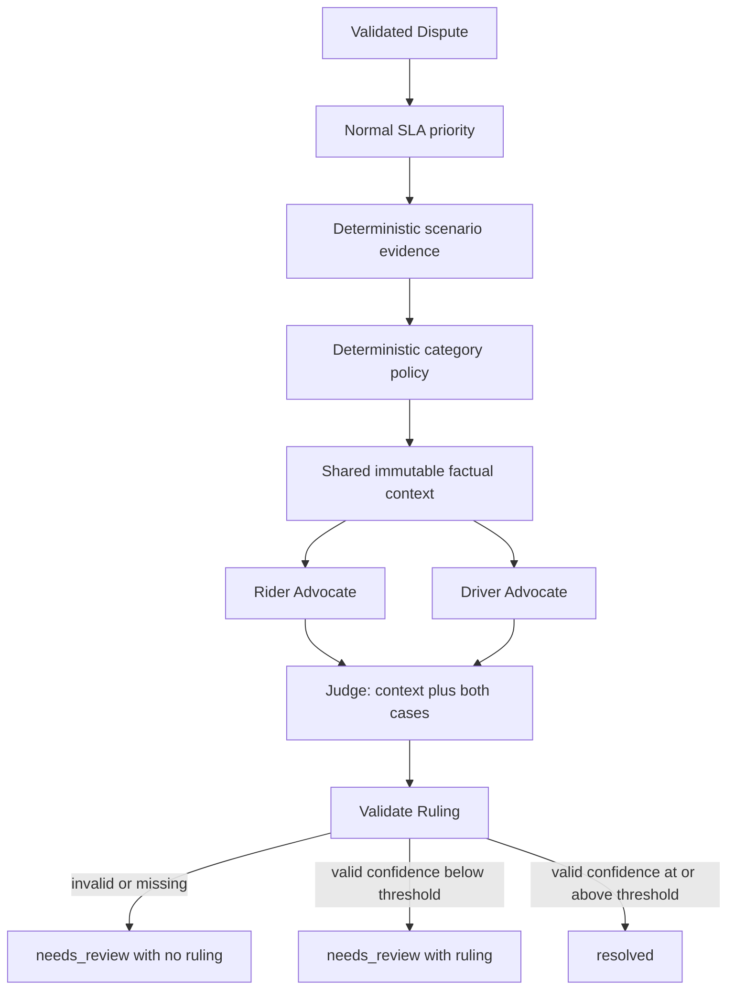

# Architecture

The existing FastAPI / LangGraph skeleton uses Pydantic contracts between
components. The UI displays a completed synchronous request; the execution
timeline is not streamed.

Advocates execute sequentially today. The graph adapters independently build
the same `AdvocateInput` for each, so execution order does not expose the
first advocate's output to the second. The Judge receives both validated
cases. No node simulates human approval or learning feedback.

## Contracts and ownership boundaries

| Contract | Purpose |
| --- | --- |
| `DisputeSubmission` | Scenario ID, validated category, two optional statements |
| `Dispute` | Validated submission plus server-selected trip/account IDs and generated dispute ID |
| `EvidenceBundle` | Typed GPS/telemetry, chat, fare, and account history |
| `PolicyContext` | Category, version, mock label, and policy rules |
| `AdvocateInput` | Immutable dispute/evidence/policy only |
| `AdvocateCase` | Side, claim, supporting points, requested outcome, stub/LLM source |
| `JudgeInput` | Factual context and correctly labelled rider/driver cases |
| `Ruling` | Decision, nullable amount, currency, reasoning, finite confidence in [0,1], source |
| `ResolutionStatus` | `resolved` or `needs_review` |
| `DisputeResult` | Validated final response, applied threshold, review reason, and execution log |

Models live in `backend/app/schemas/dispute.py`. They forbid extra fields,
are frozen, use tuples for nested collections, and revalidate model instances
at boundaries. `frontend/src/types.ts` mirrors the public JSON response;
JSON serializes tuples as arrays. The LangGraph `DisputeState` is a typed
transport container for those models, not an agent input.

Only `ruling_candidate`, between Judge and validation, accepts an untrusted
object. It is cleared before returning a result. The validator catches
invalid/missing output, sets `ruling=null`, and terminates as `needs_review`
without calling confidence routing. A Judge that raises a Pydantic
validation error also takes this path. Other execution failures remain errors;
they cannot produce a resolved response.

A valid ruling routes deterministically using the configured threshold,
including equality. The final response validates that status agrees with
the ruling and applied threshold. Confidence has no separate top-level copy.
`needs_review` is terminal and carries a reason; it is not a recorded human
decision, a queue entry, or a promise of a staffed review service.

## Data semantics

`services/scenarios.py` allowlists exactly two fixture filenames. Arbitrary
scenario strings never become paths. A scenario must match the category,
trip, and account IDs. Policy filenames derive only from the category enum.
Each load validates a fresh model; callers cannot mutate shared fixture data.

Each evidence group is an `EvidenceItem[T]`:
- available: typed non-null data and null unavailable reason;
- unavailable: null data and a non-empty reason.

Within available telemetry, fare, or history, an unknown measurement is null
and its limitation is documented. Zero means a recorded zero. An available
empty chat collection means no messages were recorded, while an unavailable
chat collection means the source could not be loaded.

The route-deviation fixture contains a fare increase, roadworks advisory,
chat without clear agreement to increased cost, and a GPS gap. The no-show
fixture contains conflicting pickup descriptions, a five-minute app timer,
GPS uncertainty, a reply before cancellation, zero driven trip distance, and
unavailable driver cancellation history. Account counts do not imply fraud.
Policy fixtures are fictional and explicitly labelled as mock.

## Extension points and current limits

- Rider Advocate implements `run(AdvocateInput) -> AdvocateCase` using Tencent
  TokenHub / Hy3. Driver Advocate remains an independent typed stub.
- Implement `JudgeAgent.run(JudgeInput) -> Ruling` independently.
- Keep data retrieval in services and orchestration/validation in graph adapters.
- Coordinate schema changes across API, graph, frontend types, and contract tests.
- Rider real mode sends only `AdvocateInput` and the separate Rider prompt to
  TokenHub's OpenAI-compatible Chat Completions endpoint. The shared adapter
  requests JSON Schema generated from `AdvocateCase`, explicitly decodes the
  raw response, and checks its envelope. The Rider validates the existing
  contract and inline evidence/policy citations. It never receives other cases
  or expected outcomes and never exposes provider reasoning content.
- `LLM_PROVIDER=mock` keeps the Rider offline and labelled as a stub. Real mode
  (`tokenhub`, model `hy3`) requires credentials and a matching regional endpoint.
  The adapter is active; SDK parsing helpers are not used. Malformed envelopes,
  decoding errors, provider failures, and invalid Rider output take the existing
  structured HTTP 502 advocate-error path; Driver/Judge do not run and no result
  or fallback case is stored. Tests use fake responses and HTTP transport.
- Driver and mock Rider report the supplied statement or its absence and identify
  themselves as stubs. Judge outputs are fixed presets: route deviation 0.85,
  no-show 0.60. These are routing demonstrations, not evidence-based decisions.
- SLA assigns normal priority. Fraud is bypassed as `not_implemented`, with
  no fabricated risk scores.
- The in-memory store holds validated results for this process only.
  `db/models.py` remains dormant scaffolding.
- RAG, embeddings, database infrastructure, multimodal analysis, human-review
  implementation, learning, queues, streaming, and real fraud detection are deferred.
