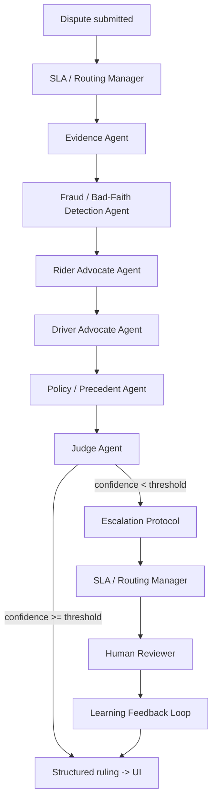

# Architecture

Multi-agent dispute resolution system for Ryde (Tencent Cloud Hackathon 2026,
Digital Native Track). Graph implemented in `backend/app/agents/graph.py`.

- **MVP core (required):** Rider Advocate, Driver Advocate, Judge.
- **Stretch:** Evidence Collection, Fraud/Bad-Faith Detection, Policy/Precedent
  (RAG), SLA/Routing Manager, Escalation Protocol, Learning Feedback Loop.
- Every node shares one state object (`DisputeState` in `agents/state.py`) and
  logs to `communication_log`, which the frontend renders as a live timeline —
  this is what makes inter-agent communication observable for judges.
